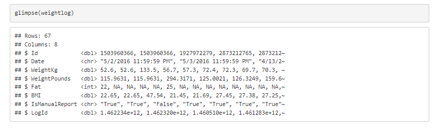
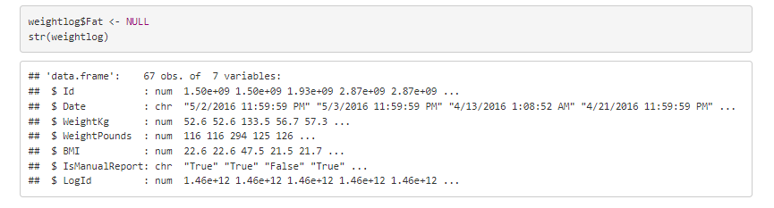
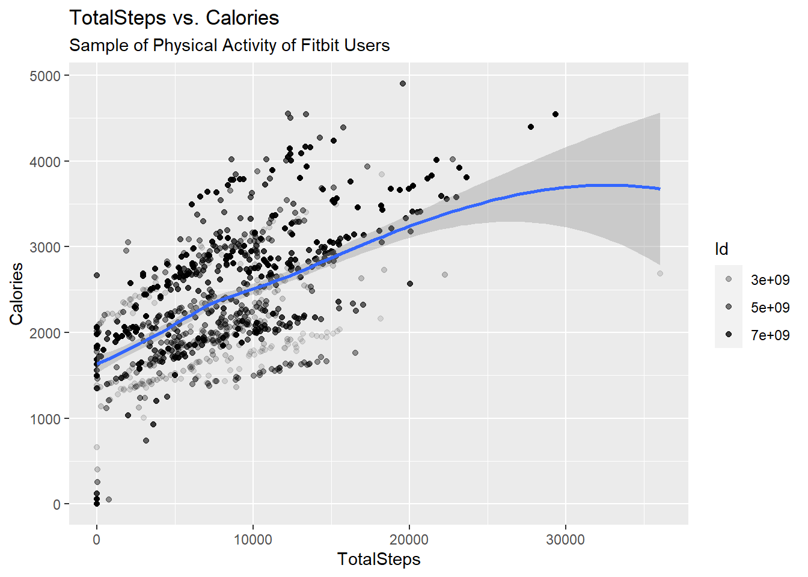

# Data Analytics Project with R: Bellabeat Company

###  Introduction

The purpose of this study is to showcase the practical tasks of a data analyst. To address essential business inquiries, I utilize the data analysis process, which includes steps such as asking relevant questions, preparing and processing data, analyzing the data, sharing insights, and taking action.

### About Bellabeat Company

Bellabeat is a high-tech company founded in 2013 by Urška Sršen and Sando Mur that creates smart products focused on women’s health. By collecting data on various aspects of health, Bellabeat empowers women with knowledge about their own health and habits. The company has grown rapidly and positioned itself as a tech-driven wellness company for women, opening offices globally and launching multiple products. Bellabeat invests heavily in digital marketing, including Google Search, social media, and video ads on YouTube. Sršen tasks the marketing analytics team with analyzing smart device usage data to gain insight into customer behavior and inform Bellabeat’s marketing strategy.

### Scenario of the Case Study

In this research, I examine one of Bellabeat’s products and analyze data obtained from smart devices to obtain a better understanding of how consumers use their devices. By gaining insights into customer behavior, the information obtained can then be used to inform Bellabeat’s marketing strategy, allowing the company to make data-driven decisions.

## Asking the right questions(Ask Phase)

During the Ask phase, I conduct thorough research and ask a series of questions to understand the data and the problem at hand. The questions are: What are the current trends in smart device usage? How can these trends impact Bellabeat’s marketing strategy? By understanding how customers use their fitness smart devices, Bellabeat can focus its marketing efforts on meeting their specific needs. Furthermore, I aim to make high-level recommendations based on the trends to inform the company’s marketing strategy. Key stakeholders, in this case, study include Urška Sršen, the company’s co-founder and Chief Creative Officer, Sando Mur, a mathematician and Bellabeat’s co-founder, and the rest of the Bellabeat marketing analytics team.

### Business Task

Based on the insights gathered during the Ask phase, the business task is to analyze smart device usage data and gain insights into how consumers use non-Bellabeat smart devices. The insights gained from this analysis can drive important business decisions and help Bellabeat better understand its customers’ needs and preferences. This analysis is then applied to one Bellabeat product to identify potential opportunities for improving the company’s marketing strategy.

## Preparing the data(Prepare Phase)

During this phase, I proceed with the download and importation of the dataset. It is crucial to ensure that all data is appropriately organized and reliable. I also apply sorting and filtering techniques to improve the dataset’s usability.

To obtain the necessary data, Bellabeat recommends using publicly available information that examines smart device users’ daily behaviors from FitBit Fitness Tracker Data. The FitBit Fitness Tracker Data is a public domain dataset provided through Mobius that contains personal fitness tracker information from thirty Fitbit users. The dataset includes minute-level physical activity, heart rate, and sleep monitoring output, providing information on daily activity, steps, and heart rate that can help analyze user behavior.

### **The dataset can be downloaded from Kaggle using this:** [link](https://www.kaggle.com/arashnic/fitbit).

It’s important to note that the dataset was generated from a distributed survey on Amazon Mechanical Turk between December 3, 2016, and December 5, 2016. The dataset comprises 18 CSV files.

### Setting up the Environment

To begin my analysis, I set up my R environment by loading the necessary R packages. Additionally, I load packages specifically designed for data cleaning to ensure my dataset is properly prepared for analysis.

### load packages

### Check working directory

To import the CSV files required for this analysis, I need to verify the current working directory using the **“getwd()”** function.

## Importing Datasets

In this phase, my objective is to import the datasets and perform several tasks, including viewing, cleaning, formatting, and organizing the data. I carefully review each dataset, apply necessary cleaning techniques, and ensure that the data is well-structured and organized.

After a thorough review of the datasets, I made some assumptions and selected the relevant data for analysis. This step is important because it allows me to focus on the most significant data, making it easier to draw accurate conclusions.

Therefore, I import all the relevant datasets and proceed to view, clean, format, and organize the data.

### Import dailyActivity dataset

### Import Calories dataset

### Import dailyIntensities_merged dataset

### Import heartrate_seconds_merged dataset

### Import sleepDay_merged dataset

### Import weightLogInfo_merged dataset

## Cleaning the Datasets

In this phase, I perform the process of cleaning, organizing, and formatting the dataset for analysis. First, I use the **“glimpse()”** and **“skim_without_charts”** functions to quickly identify any errors or inconsistencies in the data. Next, I clean the data names using the **“clean_names()”** function to ensure that the dataset is well-structured and organized. I also use **distinct()** to create unique rows for exact datasets. For formatting, I apply clear formatting techniques and convert the date columns to the appropriate date type.

### activity dataset

### Convert ActivityDate column to date format

### calories dataset

### Convert calories ActivityDay column to date format

### intensities dataset

### Convert intensities ActivityDay column to date format

### heartrate dataset

### Convert heartrate Time column to date-time format and split

### sleep dataset

### Convert sleep SleepDay column to date-time format and split

### weightlog dataset

Identifying a significant number of missing values in the Fat column, so, I have decided to remove that column from the weightlog dataset.

### Convert weightlog Date column to date-time format and split

## Summarize the dataset

### Find the total number of participants in activity data set

### Find the total number of participants in calories data set

### Find the total number of participants in intensities data set

### Find the total number of participants in heartrate data set

### Find the total number of participants in sleep data set

### Find the total number of participants in weightlog data set

***Note:*** The dataset contains activity, calories, and intensities data for 33 participants and sleep data for 24 participants. However, the heartrate and weightlog data sets only have data for 14 and 8 participants, respectively, which is not sufficient for making reliable recommendations or conclusions. Therefore, I will focus on analyzing the activity, calories, intensities, and sleep data sets for my analysis.

## Here I will perform some summary statistics about each data frame

### activity

***Note:*** The four variables that are selected - TotalSteps, TotalDistance, SedentaryMinutes, and Calories - are all related to physical activity and health, which is a key area of interest for Bellabeat and its target market. By analyzing these variables, we can gain insights into consumer behavior and preferences related to physical activity and health, which can inform the development of targeted marketing campaigns and product features.

### Summary statistics for the activity data

 Also conduct correlation analysis to understand the relationships between TotalSteps, TotalDistance, SedentaryMinutes, and Calories.

**By analyzing the correlation matrix,**

- There is a strong Positive Correlation Between Totalsteps and Totaldistance (correlation coefficient = 0.985).

- There is a moderate positive correlation between TotalSteps and Calories (correlation coefficient = 0.592).

- There is a weak negative correlation between SedentaryMinutes and TotalSteps (correlation coefficient = -0.327).

- There is no significant correlation between SedentaryMinutes and Calories (correlation coefficient = -0.107).

- Being more active is positively associated with burning more calories and spending less time being inactive.

To conclude, the data shows that there is a strong relationship between physical activity (TotalSteps and TotalDistance) and Calories burn, while time spent being inactive (SedentaryMinutes) has a negative correlation with physical activity. This information can help guide product development, marketing campaigns, and sales strategies for Bellabeat.

### calories

### Summary statistics for the calories data

### intensities

### Summary statistics for the intensities data

By summarizing this data set it can be concluded that people may not be as active as they should be, and many people may be spending too much time being sedentary.

### sleep

### Summary statistics for the sleep data

The sleep data summarizes and indicates that smart device users in the dataset slept an average of 419.5 minutes (approximately 7 hours) and spent 458.6 minutes (approximately 7.6 hours) in bed. Bellabeat could improve its marketing strategy by developing new sleep-tracking features for its existing products. Additionally, they could tailor their marketing campaigns to attract more customers. This will drive revenue growth and as well as improve customer satisfaction.

**Key Findings from this analysis**

It can be observed that the average sedentary time is more than 16 hours in both activity and intensity data sets which is considered very high.

**In correlation matrix analysis-**

1.TotalSteps and TotalDistance are strongly correlated, indicating that people who take more steps tend to cover longer distances.

2.TotalSteps and Calories are moderately positively correlated, which means that being more active is associated with burning more calories.

3.SedentaryMinutes are weakly negatively correlated with TotalSteps, suggesting that people who spend more time being inactive tend to take fewer steps.

The data also indicates that most of the participants are LightlyActive users for more than 3 hours.

It has been discovered that participants slept an average of 419.5 minutes (approximately 7 hours) and spent 458.6 minutes (approximately 7.6 hours) in bed.

## Data Visualization (Share Phase)

Here I will create some visualization based on my analysis.

### Create a relationship between TotalSteps and SedentaryMinutes

From the above graph, it is evident that there is a negative correlation between TotalSteps and SedentaryMinutes. As the SedentaryMinutes increase, the TotalSteps taken by participants tend to decrease.

### Create a relationship between TotalSteps and Calories

Based on the scattered plot graph, it can be observed that there is a positive correlation between TotalSteps and Calories, indicating that as the participants take more steps, they burn more calories.

### Create a relationship between TotalSteps and TotalDistance

### Create a relationship between TotalMinutesAsleep and TotalTimeInBed

The data displayed on the graph suggests that there is a linear relationship between Minutes Asleep and Time in Bed. Therefore, to assist users in enhancing their sleep quality, the company could consider implementing notifications to prompt them to go to bed.

### Create ggplot to visualize intensities over time

***Note:*** I merge the intensities and weightlog data sets, and then I use the ggplot2 function to create a graph that visualizes intensities over time.

Upon analyzing the relationship between the time of day and the number of very active minutes it was observed that, during the morning time participants were highly active. This insight can be leveraged by Bellabeat to send push notifications or reminders in their app to users during their most active times of day, encouraging them to engage in physical activities such as going for a run or taking a walk.

## Recommendations and Conclusion for the Business(Act Phase)

After analyzing the FitBit Fitness Tracker Data set, I gained insights that could inform Bellabeat’s marketing strategy. The target audience is individuals who work full-time jobs and spend a significant amount of time sitting at a computer or in an office environment and are seeking ways to stay fit and active. Based on the activity type analysis, users are engaging in light activity, but may need guidance on how to increase their daily activity levels for greater health benefits. Additionally, they may benefit from resources and motivational tools to help them establish healthy habits and maintain an active lifestyle.

### Recommendations to the Marketing Team

- Bellabeat’s target market is interested in physical activity and health, so the company can use the analyzed variables (TotalSteps, TotalDistance, SedentaryMinutes, and Calories) to develop targeted marketing campaigns and product features that align with consumers’ preferences and behaviors.

- TotalSteps and TotalDistance are strongly correlated, indicating that people who take more steps tend to cover longer distances. Bellabeat can use this information to market its products’ step-tracking features and emphasize how they help people achieve their fitness goals.

- TotalSteps and Calories are moderately positively correlated, which means that being more active is associated with burning more calories. Bellabeat can emphasize this relationship in its marketing campaigns and encourage customers to use its products to track their physical activity and calorie burn.

- SedentaryMinutes are weakly negatively correlated with TotalSteps, suggesting that people who spend more time being inactive tend to take fewer steps. Bellabeat can use this information to develop product features that help customers reduce their sedentary behavior and increase their physical activity.

- People in the dataset slept an average of 419.5 minutes and spent 458.6 minutes in bed, indicating a potential market for sleep-tracking features. Bellabeat can develop new sleep-tracking features and tailor its marketing campaigns to attract customers interested in tracking their sleep, driving revenue growth and improving customer satisfaction.

### Conclusion

Overall, Bellabeat can use these findings to better understand its target market’s behaviors and preferences. With this understanding, the company can develop customized products, such as the Bellabeat app, that provide to their customers’ needs. Moreover, Bellabeat can create highly targeted marketing campaigns that resonate with its target market, leading to increased revenue growth and enhanced customer satisfaction. By continuously refining its products and marketing strategies based on customer feedback, Bellabeat can establish itself as a leader in the wellness industry and further expand its customer base.

